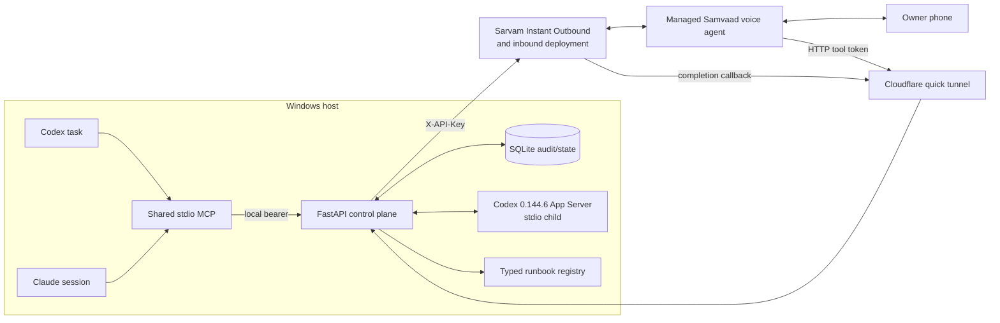

# Architecture

Agent Hotline is an independent, local control plane between coding-agent sessions, Sarvam
Samvaad, and one human owner. Its central property is that the call and policy path does not
depend on the blocked model being able to take another turn.

## System view



Only Samvaad tool and callback routes need public reachability. The MCP server, task control,
database, and administrative APIs bind to loopback.

## Component responsibilities

| Component | Owns | Does not own |
| --- | --- | --- |
| MCP server | Portable tools and typed results | Telephony, policy state, secrets |
| Daemon | Orchestration, auth, policy, dedupe, waiters, audit | Speech and arbitrary shell |
| SQLite store | Durable event/session/decision/action state | Authentication decisions |
| Sarvam client | Native request shapes, bounded retries, analytics | Duplicate-call policy |
| Samvaad | PSTN, STT, TTS, multi-turn conversation, barge-in | Final action authority |
| Codex App Server adapter | Task inspection, steering, interruption, root creation | Shell/runbook execution |
| Repository context service | Allowlisted status/diff/search/read/test evidence | Commands, test execution, arbitrary filesystem access |
| Runbook registry | Typed previews and deterministic execution | Free-form commands |
| Watchdog/hooks | Independent failure detection | Granting approval |

## Durable state

The minimum records are:

- `events`: blocker/incident, evidence references, dedupe key, current state;
- `sessions`: direction, provider, `attempt_id`, `interaction_id`, call state;
- `decisions`: structured outcome, instruction, constraints, verification state;
- `prepared_actions`: typed parameters, exact scope, action hash, expiry;
- `grants`: confirmation method, one-time state, consumption timestamp;
- `webhook_receipts`: provider idempotency key and normalized status;
- `fallback_links`: delivered/verified/consumed one-time missed-call capabilities;
- `timeline`: immutable transitions used for metrics.

The primary state progression is:

```text
DETECTED -> QUEUED -> CALLING -> CONNECTED -> DISCUSSING
         -> DECIDED -> RESUMED -> COMPLETED
```

Safe terminal alternatives are `NO_ANSWER`, `BUSY`, `FAILED`, `TIMED_OUT`, `DEFERRED`, and
`CANCELLED`. None implies approval.

When configured, a blocking call that ends without a decision may enter
`FALLBACK_PENDING` instead of terminating immediately. The daemon sends a generic
notification through an authenticated owner-controlled webhook. The browser verifies the
owner PIN before loading context, then atomically consumes the fallback when it records one
structured decision. Registered actions remain unavailable on this channel.

## Outbound decision path

1. An MCP tool, App Server event, hook, watchdog, or CLI submits a sanitized context packet.
2. The daemon atomically deduplicates the event before any provider request.
3. The daemon persists the snapshot and creates a contact session.
4. The native client starts Instant Outbound and stores the returned `attempt_id`.
5. Samvaad retrieves the event by `event_id`; the daemon returns a compact spoken brief.
6. Samvaad discusses options and records the confirmed structured decision during the call.
7. The daemon commits the decision and wakes the exact waiting request.
8. The originating agent continues with the returned constraints.
9. The post-call webhook reconciles status/transcript idempotently; it does not authorize.

## Inbound task-control path

1. The deployed Sarvam number receives a call.
2. Hotline correlates the required provider interaction and allowlists the caller before
   exposing task state; neither caller ID nor allowlisting proves identity.
3. A task reference is resolved through `thread/list`; ambiguity produces choices, never an
   automatic selection.
4. `thread/read` grounds the spoken summary.
5. Safe task mutations use `turn/steer` or `turn/interrupt`, bound to exact IDs.
6. Root creation is constrained to configured workspace roots.
7. Infrastructure actions go through registered runbooks, not the App Server or shell.
8. Source questions use the event-bound repository context service after daemon-side PIN
   verification; repository text remains untrusted and read-only, and that event cannot
   later carry an authority-bearing decision or action.

“Pause task” means interrupt the active turn and persist a pause intent. It is not permission
to terminate compute. “Terminate all batch runs” is a separate high-risk runbook requiring
readback and confirmation.

## Failure independence

The persisted snapshot is sufficient for a call when OpenAI or Anthropic is unavailable.
App Server notifications, Claude hooks, or external infrastructure monitors can submit an
event without model tool choice. If Sarvam fails, the daemon safely pauses or defers the
agent and preserves the event for retry. If the daemon restarts, durable events and grants
are recovered; in-memory waiters are recreated from stored state.

## Swappable seams

The internal contracts are provider-neutral, but the MVP deliberately has one native
transport. A future provider implements call creation and status normalization behind the
service boundary; it does not change MCP schemas or action policy. Coding-agent adapters
normalize task state into the same context packet. Message channels can consume the same
event/decision records.

This seam is not a reason to build a provider framework before the native Sarvam vertical
slice works.

## Observability

The timeline records:

- `event_detected_at`
- `call_started_at`
- `call_answered_at`
- `decision_recorded_at`
- `agent_resumed_at`
- `action_completed_at`

Derived metrics are time to contact, decision, resume, and completion. Logs contain opaque
references and state changes, never credentials, phone numbers, confirmation phrases, or
full transcripts by default.
