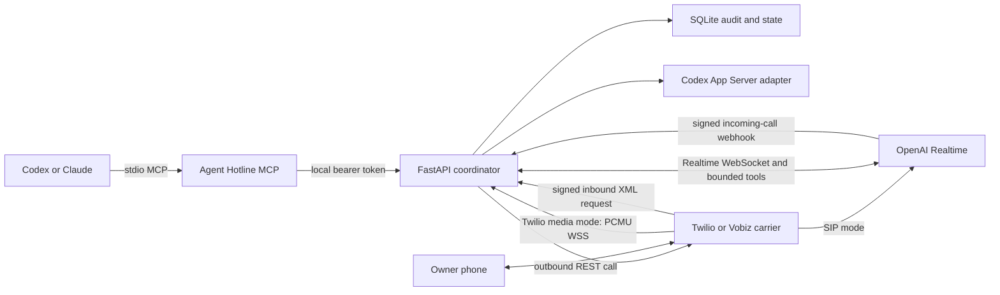
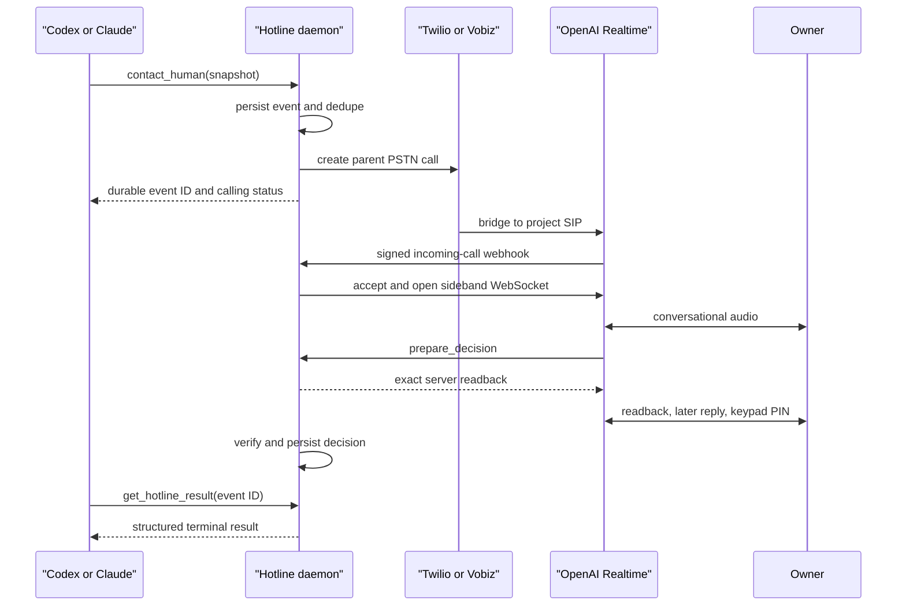

# Architecture

Agent Hotline separates conversational voice from durable authority. OpenAI Realtime conducts
the call; the local daemon decides what context and operations that call may access.



## Components

### MCP and CLI

Codex and Claude use the same local MCP server. It can create an escalation, send a
notification, request an authentication handoff, list events, report status, or run a bounded
repository query. The CLI exercises the same local daemon contract.

The originating MCP request supplies a compact snapshot. It is not a tunnel into the native
agent runtime.

### Coordinator and store

FastAPI owns request authentication, caller admission, deduplication, state transitions,
readback preparation, PIN verification, action grants, and local API boundaries. SQLite stores
events, sessions, decisions, action receipts, provider correlation, and fallback state.

### PSTN carriers

Twilio and Vobiz can carry the PSTN leg into OpenAI SIP. Twilio can instead use the daemon's
direct Media Streams adapter:

- outbound: the daemon creates a Twilio parent call with an event-bound TwiML URL; Twilio
  returns the allocated parent CallSid to that verified route before it receives the selected
  bridge;
- inbound: Twilio calls the signed incoming-voice route, which returns the bridge TwiML;
- status: the same signed route reconciles outbound parent-call events and, in SIP mode, the
  inbound `<Dial action>` result. It is lifecycle evidence, never authority;
- limits: the parent outbound Call and SIP `<Dial>` bridges have carrier-enforced ceilings in
  addition to daemon-side session expiry;
- direct media: signed WSS handshakes plus event-bound outbound or expiring-admission-bound
  inbound stream parameters are validated before PCMU audio is forwarded to an authenticated
  OpenAI Realtime WebSocket.

Vobiz follows the same durable shape with its REST call UUID and Vobiz XML callbacks. The daemon
verifies a V3 or V2 provider URL-and-nonce HMAC on every callback and durably tracks each
verified nonce against replay. Separate, domain-specific event-bound query signatures bind the
outbound answer, ring, and hangup callbacks to the durable event. The answer callback can then
bind the UUID and receive bridge XML. The authenticated inbound XML route creates a short-lived,
one-use carrier admission before returning its signed SIP bridge.

Carrier status is lifecycle evidence, never approval.

### OpenAI Realtime

In SIP mode, the daemon opens a sideband WebSocket after accepting a signed OpenAI incoming-call
webhook. In direct media mode, it opens a normal Realtime WebSocket and bridges Twilio PCMU
audio itself. In either case, the session receives:

- a bounded system prompt;
- a compact, sanitized escalation snapshot or inbound task view;
- narrow application-owned function definitions;
- no local bearer token, service signing secret, PIN, shell, raw database, or native MCP
  connection.

The voice agent uses low-eagerness semantic turn detection so the owner can pause without a
fixed silence cutoff, while automatic interruption still provides barge-in. It can hold a
natural conversation, list or inspect bounded Codex tasks, prepare decisions and actions, and
report structured tool results.

## Public and private surfaces

The default SIP provider routes are:

```text
POST /v1/openai/realtime/webhook
POST /v1/twilio/voice/incoming
POST /v1/twilio/voice/outbound
POST /v1/twilio/status
```

The Vobiz SIP profile replaces the three Twilio HTTP routes with:

```text
POST /v1/vobiz/voice/incoming
POST /v1/vobiz/voice/outbound
POST /v1/vobiz/ring
POST /v1/vobiz/hangup
```

Direct media mode replaces the OpenAI call webhook/SIP leg with `WSS /v1/twilio/media` while
retaining the signed Twilio voice and status routes.

Optional fallback uses `/fallback`, its two static assets, `/v1/fallback/open`, and
`/v1/fallback/decision`. Everything else remains local or behind separate authentication. A
production reverse proxy must enforce that split; a raw development tunnel does not.

## Outbound sequence



## Inbound sequence

The selected carrier first verifies the caller-facing phone leg. The incoming route checks the
provider signature, account, called number, direction, and E.164 allowlist, then embeds signed
correlation metadata in the SIP bridge. The OpenAI webhook is where the durable inbound event
is correlated and accepted. Direct or uncorrelated SIP is rejected.

An allowlisted caller may converse and use bounded read-only task inspection. Caller ID alone
does not authorize a decision or write.

## Decision and action protocol

A decision follows:

```text
prepare -> exact transcript + drained audio readback -> later owner speech ->
arm -> fresh DTMF PIN -> record
```

A medium- or high-risk action follows:

```text
prepare -> exact transcript + drained audio readback -> later owner response -> arm ->
fresh DTMF PIN -> confirm one-time grant -> execute once ->
record final decision and action result
```

Codex task writes are additionally blocked unless `HOTLINE_ALLOW_CODEX_WRITES=true`. Real
runbook executors are independently blocked unless `HOTLINE_ALLOW_REAL_RUNBOOKS=true`. The
built-in runbooks are mocks, so the second gate does not make them touch real infrastructure.

Codex command and turn-permission callbacks can return only exact, one-turn approvals. A separate
synchronous Codex `PermissionRequest` plugin hook brings the same phone decision path to ordinary
Desktop and CLI tasks for bounded shell and MCP requests. It emits `allow` only for a verified,
exact scope match, emits `deny` only for a verified denial, and otherwise lets the normal local
prompt continue. App Server file-change callbacks always decline, and the plugin hook abstains on
`apply_patch`, because a patch is not a practical lossless PSTN readback.

## Repository evidence

Repository access is limited to allowlisted Git roots and five operations: status, diff
summary, literal search, bounded read, and static test inventory. Results are capped, redacted,
and treated as untrusted text.

A voice repository query requires its own warning, explicit consent, and fresh PIN. Once
repository evidence is returned, that call becomes evidence-only and cannot authorize a
decision or action.

## Restart behavior

Events, sessions, correlation, tool receipts, decisions, grants, and fallback state are
durable. The MCP caller retains the event ID and can poll it again after reconnecting. Realtime
sideband events have no replay cursor, so an active call cannot be resumed safely across a
daemon restart or WebSocket continuity gap. Termination of each OpenAI and carrier leg is a
separate durable job: intent and the next retry are committed before provider I/O, ambiguous
outcomes remain pending, and startup plus background maintenance retry until the provider
confirms the leg is gone. Startup records failure instead of pretending the event stream was
recovered.

Readback delivery, owner-reply observation, collected DTMF digits, and PIN-verification windows
are deliberately transient and are never recovered.

The blocking CLI/HTTP waiter's process-local socket does not survive a daemon restart. Its
event remains durable, while MCP callers use the event ID returned at call start.
