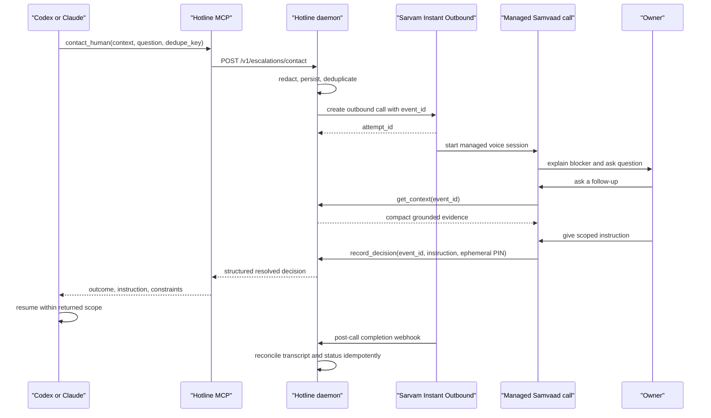
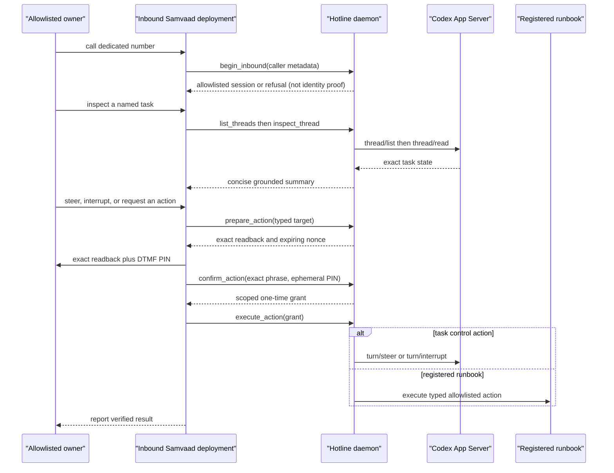

# Agent Hotline implementation plan

This is the execution plan and evidence snapshot for the native Sarvam implementation. It
uses environment-variable names in place of every phone number, credential, or provider
identifier.

> **Historical baseline:** status tables and go/no-go statements in this plan capture the
> planning-time state. They are not current operational evidence. See
> `docs/VERIFICATION.md` for the dated live v2/eight-tool verification and
> `docs/REPOSITORY_CONTEXT.md` for the pending ninth-tool rollout.

## 1. Current environment and account capabilities discovered

| Area | Discovered state |
| --- | --- |
| Host | Windows, native PowerShell |
| Project runtime | Python 3.12 through `uv` (`uv run python --version`) |
| Package manager | `uv` is installed and the lockfile is present |
| Codex | `codex-cli 0.144.6`; direct `codex app-server --stdio` is available |
| Claude | Claude Code `2.1.211`; user-scoped stdio MCP is available |
| Tunnel | `cloudflared` is installed; an ephemeral HTTPS quick tunnel is available |
| Sarvam credentials | API key, organization, and workspace have been verified without printing values |
| Sarvam telephony | One native Vobiz connection and provisioned number are active |
| Sarvam app | A draft Agent app exists; its configured app version is `1` |
| Sarvam tools | Agent HTTP tools are available in the workspace |
| Sarvam deployment | No inbound deployment has been created yet |

The repository already contains typed contracts, a native Sarvam client, the shared MCP
server, the Codex App Server transport/controller, action hashing and replay protection,
three mock-only runbooks, timeline metrics, Samvaad prompt/tool artifacts, and tests. The
persistent daemon, public callbacks, deployment, and real-call proof are the critical path.

Baseline commands:

```powershell
uv sync --python 3.12 --extra dev
uv run python --version
uv run pytest -q
uv run ruff check .
uv run agent-hotline doctor
```

## 2. Exact native Samvaad identifiers and entitlement status

Values are intentionally omitted. Presence is the evidence recorded here.

| Contract | Status | Storage |
| --- | --- | --- |
| `SARVAM_API_KEY` | Verified against the account | Local secret environment only |
| `SARVAM_ORG_ID` | Verified | Local environment only |
| `SARVAM_WORKSPACE_ID` | Verified | Local environment only |
| `SARVAM_APP_ID` | Draft app reference configured | Local environment only |
| `SARVAM_APP_VERSION` | Exact committed numeric app version | Local environment |
| `SARVAM_CONNECTION_ID` | Active native Vobiz connection verified | Local environment only |
| `SARVAM_AGENT_PHONE_NUMBER` | Provisioned and active | Local secret environment only |
| `SARVAM_INBOUND_SCHEDULE` | Optional atomic JSON; omitted means 24/7 | Local environment |
| `OWNER_PHONE_NUMBER` | Configured | Local secret environment only |
| `PUBLIC_BASE_URL` | Not yet configured | Set after starting the tunnel |
| HTTP tool entitlement | Available | Agent Studio |
| Inbound deployment ID | Reconcile with the read-only deployment plan | Local operational state |

No document, log, fixture, screenshot, commit message, or spoken response may contain the
actual values.

## 3. Go/no-go result for Instant Outbound, inbound deployment, and live tools

| Capability | Result now | Evidence needed to turn green |
| --- | --- | --- |
| Instant Outbound | **NO-GO for demo** | Public callback URL, daemon healthy, API returns an `attempt_id`, and the owner phone rings once |
| Inbound deployment | **REQUIRES LIVE VALIDATION** | Verify a deployment binding `${SARVAM_APP_VERSION}`, the active connection, and the provisioned number; then complete an allowlisted inbound call |
| Live HTTP tools | **CAPABILITY GO / E2E PENDING** | Samvaad calls `get_context`, receives event-bound context, then `record_decision` wakes the waiting request |

Stop and fix the native path if any of these fail. Do not begin a raw Saaras/Bulbul,
Twilio, Exotel, Pipecat, or Vobiz audio implementation until the exact native failure and
Sarvam response are recorded.

## 4. Outbound and inbound sequence diagrams

Outbound vertical slice:



Inbound control:



## 5. Minimal architecture and components

The smallest working system has five runtime pieces:

1. A persistent local FastAPI daemon owns state, policy, deduplication, timeouts, and audit.
2. A short-lived stdio MCP process translates Codex/Claude tools into authenticated daemon
   requests.
3. The native Sarvam client creates Instant Outbound calls and reconciles callbacks.
4. Managed Samvaad owns PSTN, speech recognition, turn-taking, barge-in, and speech output.
5. A supervised Codex App Server child provides structured task inspection and safe task/turn
   control independently of model tool choice.

SQLite is the source of truth for events, sessions, decisions, prepared actions, grants,
webhook receipts, and timeline entries. A Cloudflare quick tunnel exposes only the public
Samvaad tools and callback route; local MCP/administrative routes remain protected by
`HOTLINE_LOCAL_TOKEN`.

The daemon must stay useful if an LLM provider is failing. It can call the owner from a
watchdog event and answer from the persisted snapshot even when the original agent cannot
take another turn.

## 6. File-by-file repository plan

| Path | Responsibility | Plan/checkpoint |
| --- | --- | --- |
| `src/agent_hotline/settings.py` | Secret-safe environment contract | Keep all identifiers external; validate startup |
| `src/agent_hotline/contracts.py` | MCP/HTTP request and response models | Keep strict and transport-neutral |
| `src/agent_hotline/models.py` | Durable event/session/action models | Use explicit state transitions |
| `src/agent_hotline/security.py` | Canonical action hashes, expiring tokens, replay defense | Fail closed and test tampering |
| `src/agent_hotline/runbooks.py` | Typed action allowlist | Demo actions remain mock-only |
| `src/agent_hotline/sarvam.py` | Instant Outbound, deployment, analytics, webhook models | Prove one real outbound call |
| `src/agent_hotline/codex_app_server.py` | Direct stdio App Server supervision and safe task controls | Verify against Codex `0.144.6` |
| `src/agent_hotline/mcp_server.py` | Shared stdio MCP tools | Register in both clients |
| `src/agent_hotline/client.py` | Local authenticated daemon client | Never connect MCP directly to Sarvam |
| `src/agent_hotline/metrics.py` | Time-to-contact/decision/resume derivation | Surface in event result/demo |
| `src/agent_hotline/store.py` | SQLite schema, atomic transitions, idempotency | Implement before real call |
| `src/agent_hotline/service.py` | Escalation orchestration and decision waiters | Wake on mid-call decision |
| `src/agent_hotline/api.py` | Local API, public tools, callback authentication | Expose the minimum route set |
| `src/agent_hotline/demo.py` | Deterministic RU-incident scenario | Support fake and native transport |
| `src/agent_hotline/cli.py` | Setup, doctor, serve, install, call, events, demo | Commands must remain secret-safe |
| `samvaad/agent_prompt.md` | Managed voice policy and style | Paste into app version `1` |
| `samvaad/variables.json` | Event-bound call variables | Keep identifiers opaque in speech |
| `samvaad/tool_contracts.md` | Agent Studio HTTP tool definitions | Configure after tunnel starts |
| `plugins/agent-hotline/` | Codex plugin, MCP entry, operational skill | Install after editable CLI |
| `tests/` | Contracts, security, provider, storage, API, demo, App Server | Unit first; real phone test is manual |
| `docs/` | Plan, operations, security, compatibility, demo, disclosure | Keep status candid and redacted |

If final filenames differ, preserve the boundaries: provider client, persistence, service
orchestration, public API, MCP, App Server, and deterministic demo must not collapse into one
process-global module.

## 7. Pydantic/JSON schemas

The common escalation request is strict and provider-neutral:

```json
{
  "source": "codex_mcp",
  "kind": "incident",
  "severity": "high",
  "summary": "The demo database capacity is exhausted.",
  "question": "Raise the demo limit or leave deployment paused?",
  "proposed_actions": [
    {
      "action_type": "demo.increase_db_ru_limit",
      "summary": "Temporarily raise the deterministic demo limit.",
      "parameters": {"target_ru": 800},
      "risk": "high"
    }
  ],
  "context": {
    "thread_id": "thread_opaque",
    "workspace_ref": "workspace_opaque",
    "test_summary": "All deterministic tests passed.",
    "owner_constraints": ["Do not run migrations."]
  },
  "dedupe_key": "demo-ru-incident-v1",
  "no_answer_policy": "pause",
  "wait_for_decision": true,
  "timeout_seconds": 600
}
```

The authoritative mid-call `record_decision` request is structured:

```json
{
  "event_id": "evt_opaque",
  "outcome": "instruct",
  "instruction": "Raise the demo limit, rerun tests, then continue. Do not run migrations.",
  "constraints": [],
  "approved_action_ids": [],
  "confirmation_method": "spoken_plus_dtmf",
  "confirmation_pin": "<ephemeral owner DTMF PIN>"
}
```

A high-risk action has a separate `PreparedAction` and one-time `ActionGrant`. The
daemon accepts every decision outcome only during a direction-matched,
provider-correlated live session after verifying the PIN. It persists
`identity_verified: true`; `identity_verified` is never a Samvaad request field, and the PIN
and confirmation method are not persisted in the `Decision`. The live `record_decision`
arrays remain empty; ordinary approval uses `outcome: approve` plus a PIN, while a
registered action is authorized only by `confirm_action` and audited by `execute_action`.
The action
hash binds action type, normalized parameters, workspace/task, commit or state hash,
environment, expiry, and runbook revision. Free-form speech is never an executable schema.

## 8. Sarvam API requests, webhook handling, and tool contracts

The native client sends `X-API-Key: ${SARVAM_API_KEY}` and uses:

- Instant Outbound:
  `POST https://apps.sarvam.ai/api/outbounds/v1/orgs/${SARVAM_ORG_ID}/workspaces/${SARVAM_WORKSPACE_ID}/outbounds`
- Inbound deployments:
  `POST https://apps.sarvam.ai/api/app-authoring/v1/orgs/${SARVAM_ORG_ID}/workspaces/${SARVAM_WORKSPACE_ID}/deployments`
- Attempt analytics:
  `GET https://apps.sarvam.ai/api/analytics/v1/${SARVAM_ORG_ID}/${SARVAM_WORKSPACE_ID}/${SARVAM_APP_ID}/attempts`

The outbound body contains `app_id`, numeric `app_version`, the active connection, the
provisioned agent number, the owner number, event-bound `agent_variables`, and a callback
URL. The response must contain an `attempt_id`, which is persisted before waiting.

Public Hotline contracts:

- `POST /v1/sarvam/tools/context` using `HOTLINE_TOOL_TOKEN`
- `POST /v1/sarvam/tools/record-instruction` using `HOTLINE_TOOL_TOKEN`
- `POST /v1/sarvam/tools/prepare-action` using `HOTLINE_TOOL_TOKEN`
- `POST /v1/sarvam/tools/confirm-action` using `HOTLINE_TOOL_TOKEN`
- `POST /v1/sarvam/tools/execute-action` using `HOTLINE_TOOL_TOKEN`
- `POST /v1/sarvam/tools/begin-inbound` using `HOTLINE_TOOL_TOKEN`
- `POST /v1/sarvam/tools/threads/list` using `HOTLINE_TOOL_TOKEN`
- `POST /v1/sarvam/tools/threads/inspect` using `HOTLINE_TOOL_TOKEN`
- `POST /v1/sarvam/webhooks/instant-outbound/{callback-token}` for provider reconciliation

Webhook processing validates the callback binding, stores a receipt key atomically, links
`attempt_id`/`interaction_id`, records terminal call state and transcript, and does not
create an approval. Duplicate or delayed webhooks return the existing receipt. A mid-call
`record_decision` is the latency-critical path that wakes MCP.

## 9. Samvaad app states, variables, prompt, and settings

Use one managed Telephony Agent app and set `SARVAM_APP_VERSION` to its exact committed
numeric version.

Suggested state flow:

```text
start -> verify_direction -> load_context -> discuss
      -> readback_instruction -> record_decision -> close
      -> prepare_action -> exact_readback -> verify_second_factor
      -> confirm_action -> execute_action -> record_decision -> close
```

Required call variables are `event_id`, `direction`, `trigger`, `urgency`,
`event_summary`, and optional `thread_id`. Never place credentials, phone numbers, raw
workspace paths, or confirmation secrets in agent variables.

Settings:

- English default, with natural Hindi/Hinglish switching.
- Lowest-latency available managed telephony model.
- Barge-in enabled.
- Short responses and one clarification at a time.
- Context tool before factual code/incident claims.
- No passwords, OTPs, private keys, recovery codes, or arbitrary commands.
- No answer or tool failure ends safely with no grant.

The source of truth for the prompt, variables, and HTTP contracts is the `samvaad/`
directory.

## 10. Codex App Server methods/events

For Codex `0.144.6`, launch the actual executable directly as:

```text
codex app-server --stdio
```

Perform the `initialize` request and `initialized` notification before other traffic.
The implemented client allowlist is:

- `thread/list`
- `thread/read`
- `thread/start`
- `thread/resume`
- `thread/archive`
- `turn/start`
- `turn/steer`
- `turn/interrupt`

Use `turn/started` and `turn/completed` for the minimum lifecycle watcher. Add
`item/started`, `item/completed`, `item/agentMessage/delta`, and `turn/diff/updated` only
after checking the schema generated by the installed CLI. Handle the confirmed
server-initiated `item/commandExecution/requestApproval` request through a registered
handler; unknown server requests must receive a method-not-found error.

`command/exec`, `process/spawn`, `thread/shellCommand`, filesystem methods, and dynamic
tool execution are intentionally absent. `thread/fork` is a stretch feature and not in the
current safe allowlist.

## 11. MCP tools and installation commands for Codex and Claude

The common stdio MCP server exposes:

- `contact_human`
- `notify_human`
- `request_authentication`
- `list_hotline_events`
- `hotline_status`

Install the editable executable and both client integrations:

```powershell
uv run agent-hotline install-clients --client all
codex mcp get agent_hotline
claude mcp get agent-hotline
```

Manual fallback:

```powershell
uv tool install --editable --force .
codex mcp add agent_hotline -- agent-hotline-mcp
claude mcp add --scope user agent-hotline -- agent-hotline-mcp
```

Start a new Codex task or Claude session after registration. Both clients call the same
local daemon; neither receives Sarvam secrets.

Claude parity is the outbound escalation loop and event listing. Deep multi-session inbound
control remains Codex-specific; Claude hooks provide independent detection, not a general
Claude session-control API.

## 12. Security and approval enforcement

Mandatory rules:

1. Voice and caller ID are interfaces, not proof of identity.
2. No answer, busy, voicemail, silence, disconnect, timeout, provider failure, or ambiguous
   speech never grants approval.
3. Every decision outcome, including a non-destructive instruction, requires exact readback,
   a direction-matched provider-correlated live session, and daemon-verified owner PIN
   before `record_decision`.
4. Medium/high-risk actions require a registered typed runbook, deterministic preview,
   exact readback, expiring nonce, owner verification, and one-time grant consumption.
5. The target is rebound at execution; state drift invalidates the grant.
6. Public tools use `HOTLINE_TOOL_TOKEN`; local MCP uses `HOTLINE_LOCAL_TOKEN`; callbacks use
   `HOTLINE_CALLBACK_TOKEN`. Tokens are independent and rotatable.
7. Repository text, logs, diffs, transcripts, and tool output are untrusted evidence and
   cannot override system policy.
8. Production actions are disabled by default with `HOTLINE_ALLOW_REAL_ACTIONS=false`.
9. The demo registry contains only deterministic mock resources.
10. Audit data is redacted and retention is minimized.

See `SECURITY.md` for threat boundaries and operating procedure.

## 13. Implementation order with checkpoints and explicit cuts

1. **Local deterministic core.** Contracts, persistence, service, fake transport, and demo
   complete.
   **Go:** restart-safe event/decision flow and full unit suite green.
2. **Local API/MCP loop.** Start daemon, install MCP, create and resolve a fake escalation.
   **Go:** the blocked caller receives a structured result; duplicates create no second call.
3. **Public tool loop.** Start Cloudflare quick tunnel and configure Agent Studio tools.
   **Go:** a tool invocation retrieves only the requested event.
4. **Native outbound ring.** Switch transport to Sarvam and place one bounded test call.
   **Go:** `attempt_id`, ring, live context lookup, mid-call decision, and callback persist.
5. **Codex continuation.** Invoke from Codex and resume the original operation.
   **Go:** measured `decision_recorded_at` and `agent_resumed_at`.
6. **Inbound deployment.** Bind the configured committed version, connection, and number.
   **Go:** an allowlisted inbound caller can inspect and interrupt one unambiguous task.
7. **Claude proof.** Invoke the same MCP tool from Claude.
   **Go:** identical structured result contract.
8. **Demo hardening.** Rehearse, record fallback, and freeze.

Cut in this order: dashboard polish, SMS, companion reasoning thread, Claude inbound session
control, provider abstraction, raw audio, and real infrastructure actions. Never cut
authentication, no-answer safety, idempotency, or the backup recording.

## 14. Automated and real-call test plan

Automated gate:

```powershell
uv run pytest -q
uv run ruff check .
```

Coverage must include strict contracts, timezone validation, secret redaction, E.164
validation, action hash binding, token tampering/expiry, replay rejection, mock runbook
allowlists, Sarvam request shapes/retries, App Server handshake/correlation/restart,
workspace-bounded task control, SQLite idempotency, API authentication, waiters, webhook
deduplication, and metrics.

Real-call matrix:

| Test | Expected result |
| --- | --- |
| Answer and discuss for three turns | Context tool is called; decision wakes MCP |
| Interrupt the agent | Barge-in works without losing state |
| No answer | Event pauses or defers; no approval |
| Busy/failed/disconnect | Terminal safe state; no approval |
| Repeat identical escalation | One active call only |
| Repeat webhook | No duplicate decision/timeline |
| Wrong tool token | `401` without event disclosure |
| Changed action after readback | Confirmation rejected |
| Wrong caller/second factor | High-risk action rejected |
| Inbound ambiguous task name | At most three choices; no mutation |
| Codex process exits | Watchdog reports failure and can restart safely |
| Claude MCP invocation | Same structured outbound result |

## 15. Live demo and backup procedure

Primary scenario: a rate-limit change has passed tests, but the deterministic database RU
incident blocks deployment. Hotline rings, answers a retry-logic follow-up from current
context, reads back a constrained instruction, confirms a mock-only RU runbook, and returns
the instruction to the original agent. The timeline ends:

```text
BLOCKED -> CALLING -> DISCUSSING -> CONFIRMED -> RESUMED -> COMPLETED
```

Use:

```powershell
uv run agent-hotline serve
cloudflared tunnel --url http://127.0.0.1:8787
uv run agent-hotline doctor --live
uv run agent-hotline demo
uv run agent-hotline events --limit 10
```

The offline rehearsal is:

```powershell
uv run agent-hotline demo --auto-decide
```

Record a backup only after a genuine call completes. It must show the ring, at least three
turns, one context lookup, confirmation, agent resumption, final state, and metric. Never
present the offline simulation or a recording as a live call.

## 16. Open risks requiring a five-minute real-world validation

- Does the exact `${SARVAM_APP_VERSION}` accept the Instant Outbound payload with this connection?
- Does the provisioned number originate a call to the configured owner number?
- Can the quick-tunnel hostname receive a Samvaad HTTP tool request and callback?
- Are tool authorization headers preserved by Agent Studio?
- Does `record_decision` return fast enough for natural turn-taking?
- What exact callback statuses and transcript fields arrive from the live account?
- Can the active number be bound to a new inbound deployment without a group conflict?
- What inbound caller metadata is available for verification?
- Are barge-in, Hindi/Hinglish, and the selected managed voice enabled on the committed version?
- Do DND/NDNC, concurrency, or retry rules affect this destination?
- Does Windows resolve a real `codex.exe`, rather than an npm command shim, for direct
  App Server subprocess launch?
- Does a new Codex/Claude session discover all five MCP tools after installation?

Log only result categories and opaque attempt/deployment references. Do not paste raw API
responses into committed files.

## 17. First concrete coding task after plan approval

Complete the restart-safe local vertical slice: SQLite store plus FastAPI routes plus a fake
provider implementation that lets `contact_human` create one deduplicated event, wait for
`record_decision`, return the structured decision, and reconcile a duplicate-safe
completion webhook. Add integration tests, then run the offline demo. Only after that gate is
green should `PUBLIC_BASE_URL` be set and one native Sarvam call be attempted.
